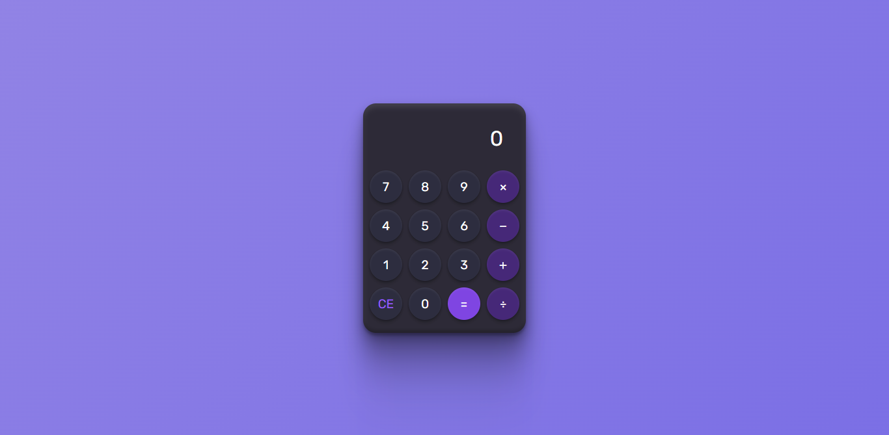

# 🧮 Calculator

A modern, **neumorphic-style** web calculator built using **HTML, CSS, and JavaScript**. This project replicates the elegant calculator design from Figma, featuring smooth shadows, interactive buttons, and a clean UI.

  


---

## 🚀 Features

✅ **Design** – Soft shadows and smooth UI inspired by modern UI trends.  
✅ **Basic Arithmetic Operations** – Supports Addition, Subtraction, Multiplication, and Division.  
✅ **Dynamic Display** – Shows input expressions before calculating results.  
✅ **Responsive Design** – Works on different screen sizes.  
✅ **Smooth Interactions** – Buttons with real-time visual feedback.  

---

## 🛠️ Tech Stack

- **HTML** – Structure of the application.  
- **CSS** – Styling with neumorphic effects.  
- **JavaScript** – Functional logic for calculations.  

---

## 📂 Setup & Installation

1. **Clone the repository**  
   ```sh
   git clone https://github.com/NeerajKumarCodes/Calculator.git
   cd calculator
   ```

2. **Launch the Calculator**
  By double clicking index.html file.

---

## 📌 Author

**Neeraj Kumar**  
🚀 Full-Stack Developer | MERN Stack | Python | SQL  

🔗 [LinkedIn](https://www.linkedin.com/in/maineerajhu/) | 🌎 [Portfolio](https://neerajkumarcodes.github.io/Portfolio/)
